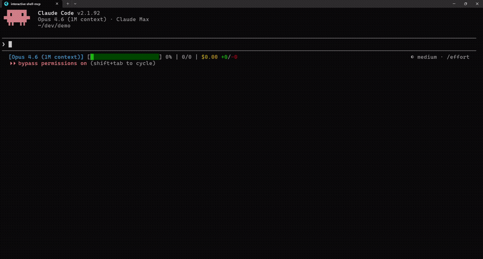
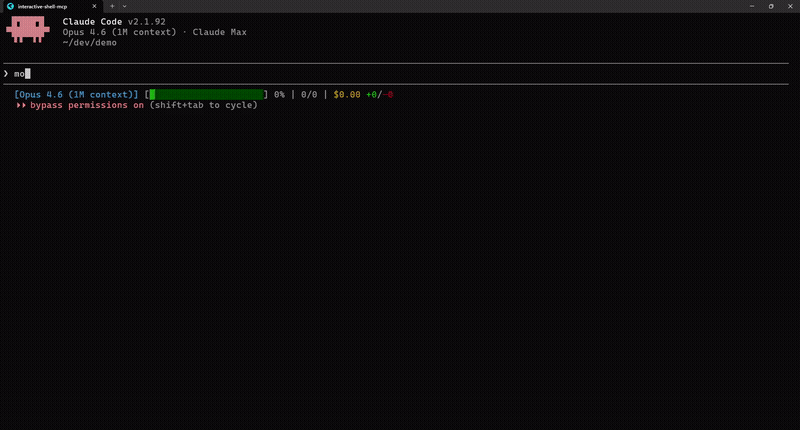

# Interactive Shell MCP

[](LICENSE)
[](https://nodejs.org)
[](https://modelcontextprotocol.io)

MCP server for interactive shell sessions with TUI support. Gives AI agents persistent terminals, interactive prompt navigation, rendered screen reading, and output search.

## Demo

| Without MCP | With MCP |
|:-----------:|:--------:|
|  |  |
| *"htop is interactive and can't run"* | *Launches htop, reads screen, extracts process data (2x speed)* |

## Why This Exists

Most AI coding tools run shell commands in isolation: each command starts a fresh shell, interactive prompts are impossible, and TUI apps just dump raw escape codes. This MCP server provides persistent PTY sessions with a virtual terminal emulator (`@xterm/headless`) so agents can maintain shell state, navigate interactive prompts with arrow keys, and read rendered terminal screens as clean text.

**Three output modes:**

| Mode | Best for | What you get |
|------|----------|-------------|
| **streaming** | Regular commands (ls, git, npm) | Raw sequential output, cleared after read |
| **snapshot** | Live-updating apps (top, htop) | Current terminal buffer tail |
| **screen** | TUI apps, prompts, anything visual | Rendered 2D text grid (what a human sees) |

## Quick Start

```bash
git clone https://github.com/lightos/interactive-shell-mcp.git
cd interactive-shell-mcp
npm install && npm run build
claude mcp add interactive-shell node dist/src/server.js
```

Then ask Claude: *"monitor htop and tell me what's using the most CPU"*

## Features

- Rendered screen reading from TUI apps via `@xterm/headless`
- `waitForIdle` across all read tools (no more guessing with sleep)
- Screen search with text and regex pattern matching
- Rectangular region extraction with row/col coordinates
- Shell allowlist: bash, zsh, fish, sh, dash, ksh, powershell.exe, pwsh, cmd.exe
- Auto-cleanup after 10min idle, exit code detection for 60s after process exit
- Cross-platform: Unix/Linux/macOS + Windows

## Use Cases

- **Interactive scaffolding & migrations**: `npx create-next-app`, `drizzle-kit push`, `prisma migrate`, `npm init`, or any inquirer/clack-based CLI
- **System monitoring**: `htop`, `btop`, `top`, `iftop`, `duf` with process search and region extraction
- **DevOps TUIs**: `lazydocker`, `lazygit`, `k9s`, `terraform console`
- **Remote sessions**: `ssh` into servers, including nested TUI apps over SSH
- **Database CLIs**: `psql`, `mysql`, `redis-cli`, `mongosh` in interactive mode
- **Network tools**: `netcat`/`ncat`, `nmap`, `airodump-ng`, `tcpdump`
- **REPLs & debuggers**: `python`, `node`, `irb`, `gdb`/`lldb`
- **Text editors**: `vim`, `nano`, `emacs -nw`

## MCP Configuration

### Claude Code (CLI)

```bash
claude mcp add interactive-shell node /path/to/interactive-shell-mcp/dist/src/server.js
```

### Claude Desktop

Add to `~/Library/Application Support/Claude/claude_desktop_config.json` (macOS) or `%APPDATA%\Claude\claude_desktop_config.json` (Windows):

```json
{
  "mcpServers": {
    "interactive-shell": {
      "command": "node",
      "args": ["/path/to/interactive-shell-mcp/dist/src/server.js"]
    }
  }
}
```

### VS Code / Cursor

Add to your MCP settings (`.vscode/mcp.json` or `~/.cursor/mcp.json`):

```json
{
  "mcpServers": {
    "interactive-shell": {
      "command": "node",
      "args": ["/path/to/interactive-shell-mcp/dist/src/server.js"]
    }
  }
}
```

## Tools Reference

### `start_shell_session`

Spawn a new PTY shell with a virtual terminal emulator.

| Parameter | Type | Required | Description |
|-----------|------|----------|-------------|
| `cols` | number | no | Terminal columns (default: 120, max: 500) |
| `rows` | number | no | Terminal rows (default: 40, max: 200) |
| `shell` | string | no | Shell to use (default: `$SHELL` or `bash`) |
| `cwd` | string | no | Working directory (default: server cwd) |

Returns `{ sessionId, cols, rows }`

### `send_shell_input`

Write input to the PTY. Appends carriage return by default.

| Parameter | Type | Required | Description |
|-----------|------|----------|-------------|
| `sessionId` | string | yes | Session ID |
| `input` | string | yes | Text to send. Raw mode: `\x1b[A` (up), `\x1b[B` (down), `\r` (enter) |
| `raw` | boolean | no | Send without appending CR. Parses escape sequences. (default: false) |

### `read_shell_output`

Read output from the PTY. Three modes: streaming (default), snapshot, screen.

| Parameter | Type | Required | Description |
|-----------|------|----------|-------------|
| `sessionId` | string | yes | Session ID |
| `mode` | string | no | `"streaming"`, `"snapshot"`, or `"screen"` |
| `waitForIdle` | number | no | Wait for N ms of silence before reading (max: 5000ms) |
| `maxBytes` | number | no | Max bytes for streaming mode (default: 100KB) |
| `snapshotSize` | number | no | Snapshot buffer size (default: 50KB) |
| `rows` | number | no | Screen mode: start row (0-based) |
| `rowEnd` | number | no | Screen mode: end row (exclusive) |
| `includeEmpty` | boolean | no | Screen mode: include trailing empty lines (default: true) |
| `trimWhitespace` | boolean | no | Screen mode: trim trailing whitespace per line (default: false) |

Screen mode returns cursor position, terminal dimensions, and alternate buffer state in metadata.

### `get_screen_region`

Extract text from a rectangular region of the screen.

| Parameter | Type | Required | Description |
|-----------|------|----------|-------------|
| `sessionId` | string | yes | Session ID |
| `startRow` | number | yes | Start row (0-based, inclusive) |
| `startCol` | number | yes | Start column (0-based, inclusive) |
| `endRow` | number | yes | End row (exclusive) |
| `endCol` | number | yes | End column (exclusive) |
| `trimWhitespace` | boolean | no | Trim trailing whitespace per line (default: false) |
| `waitForIdle` | number | no | Wait for N ms of silence before reading (max: 5000ms) |

### `get_screen_cursor`

Get cursor position and current line text.

| Parameter | Type | Required | Description |
|-----------|------|----------|-------------|
| `sessionId` | string | yes | Session ID |
| `waitForIdle` | number | no | Wait for N ms of silence before reading (max: 5000ms) |

Returns `{ cursor: { x, y }, currentLine, isAlternateBuffer }`

### `search_screen`

Search the terminal screen for text or regex. Returns up to 50 matches.

| Parameter | Type | Required | Description |
|-----------|------|----------|-------------|
| `sessionId` | string | yes | Session ID |
| `pattern` | string | yes | Text or regex pattern |
| `regex` | boolean | no | Treat pattern as regex (default: false) |
| `waitForIdle` | number | no | Wait for N ms of silence before reading (max: 5000ms) |

Returns `{ results: [{ row, col, text }], count }`

### `list_sessions`

List all active sessions with metadata. No parameters.

Returns `{ sessions: [{ sessionId, shell, cols, rows, isAlternateBuffer, idleSeconds }] }`

### `resize_shell`

Resize an active session's terminal.

| Parameter | Type | Required | Description |
|-----------|------|----------|-------------|
| `sessionId` | string | yes | Session ID |
| `cols` | number | yes | New columns (1-500) |
| `rows` | number | yes | New rows (1-200) |

### `end_shell_session`

Close the PTY and clean up resources.

| Parameter | Type | Required | Description |
|-----------|------|----------|-------------|
| `sessionId` | string | yes | Session ID |

## Usage Examples

> These show the MCP tool call patterns for developers building integrations. End users just talk to their AI agent naturally.

### Reading a TUI App

```javascript
await send_shell_input(sessionId, "htop");
const { output, metadata } = await read_shell_output(sessionId, {
  mode: "screen",
  waitForIdle: 500
});
// output: rendered htop as clean text (CPU bars, process table, etc.)
// metadata.isAlternateBuffer: true (htop uses alternate screen)

// Extract just the process list (rows 6-30)
const processes = await get_screen_region(sessionId, {
  startRow: 6, startCol: 0, endRow: 30, endCol: 120,
  trimWhitespace: true
});
```

### Navigating Interactive Prompts

```javascript
// Send arrow keys and enter in raw mode
await send_shell_input(sessionId, "\\x1b[B", { raw: true });  // down arrow
await send_shell_input(sessionId, " ", { raw: true });         // space to select
await send_shell_input(sessionId, "\\r", { raw: true });       // enter to confirm

// Read what the prompt looks like now
const screen = await read_shell_output(sessionId, {
  mode: "screen", waitForIdle: 300
});
```

### Waiting for Command Output

```javascript
await send_shell_input(sessionId, "npm install");
const output = await read_shell_output(sessionId, {
  waitForIdle: 1000  // wait for 1s of silence
});
```

### Searching for Content

```javascript
// Find all error lines
const errors = await search_screen(sessionId, {
  pattern: "error|Error|ERROR",
  regex: true,
  waitForIdle: 500
});
// [{ row: 12, col: 0, text: "Error" }, ...]
```

## Session Behavior

- **Auto-cleanup**: Sessions idle >10 minutes are disposed automatically
- **Exit detection**: When a shell exits, tools return `"Session exited with code N"` for 60 seconds instead of a generic invalid ID error
- **Shell allowlist**: Only known shells can be spawned (bash, zsh, fish, sh, dash, ksh, powershell.exe, pwsh, cmd.exe). Unknown values fall back to platform default.

## License

MIT
